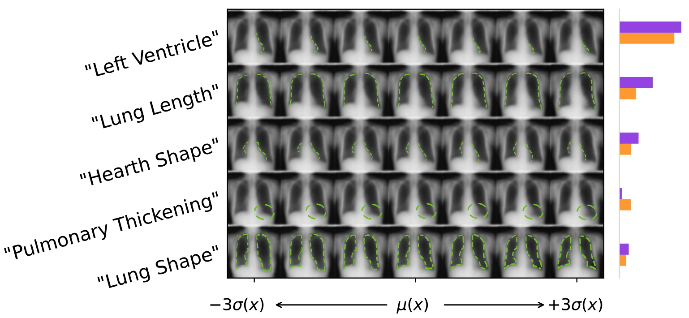

# CLAP Interpretable Predictions 👏🏻
Official codebase for the paper ([Arxiv preprint](https://arxiv.org/abs/2204.00492)) <br />

[1] _Provable concept learning for interpretable predictions using variational inference_, <br /> 
Taeb A., Ruggeri N., Schnuck C., Yang F.



We present _CLAP_, an inherently interpretable prediction model. <br />
Its VAE-based architecture allows the discovery and disentanglement of relevant concepts, encoded in the latent space, 
which are utilized by a simple, concurrently trained classifier.   
The final architecture allows to exploit provably interpretable, predictive and minimal concepts to assist practitioners 
in making informed predictions. 


### Code usage
To start training _CLAP_ on a dataset:

- download the desired dataset and place it in the `./data` directory. 
Alternatively, change the default data directory specified at `src.data.utils.DATA_DIR`
- run the terminal command. The datasets available are 
`MPI`, `Shapes3D`, `SmallNORB`, `ChestXRay`, `PlantVillage` [1]. 

For example, to train _CLAP_ on the `MPI` dataset, the terminal command is
```python
python main.py --dataset MPI
```
More options for training, e.g. latent space dimension and regularization parameters, are specified inside `main.py`.


